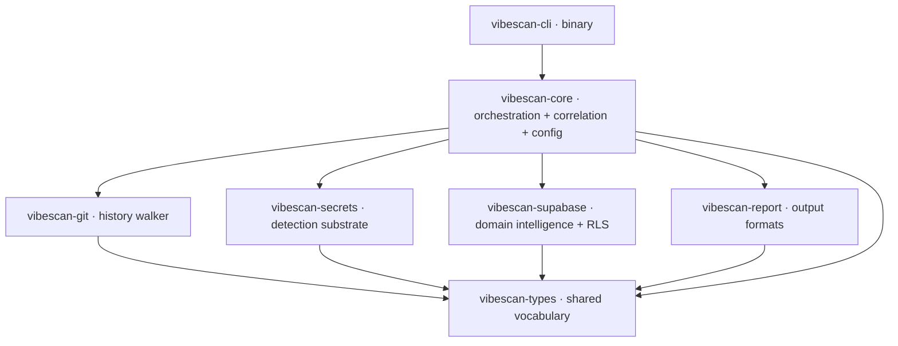
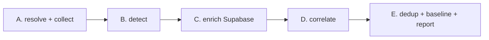

# vibescan — Architecture & Engineering Specification (v1)

**Audience:** the implementing agent (Codex).
**Status:** design spec. Contains no implementation. Describes crate boundaries, contracts, data flow, algorithms at the behavioral level, and non-functional constraints. Field-level type shapes are given as `name: type — meaning`, not as Rust source; choose idiomatic representations at implementation time.

**What Codex is building in v1:** a local-first Rust CLI that scans a vibe-coded web app (Supabase + Next.js/TS stack) for the failure classes behind real breaches, and — this is the point of the tool — *correlates* findings across the codebase, its git history, and the live data API into single, reproduced kill-chains. Generic secret scanning is treated as a solved substrate, not a place to innovate. The defensible logic lives in one crate: Supabase key semantics + RLS detection + correlation.

---

## 1. Design principles (invariants — do not violate)

1. **Local-first, network-explicit.** Modules split into two disjoint classes: `LocalStatic` (touch only the filesystem and the local git object store — *never* the network) and `Network` (talk to the user's own Supabase project). `LocalStatic` is the default. Every `Network` action is opt-in, logged, and — for anything that could mutate state — gated behind explicit ownership confirmation. This boundary is architectural, not a runtime flag: the crate dependency graph enforces that `LocalStatic` code paths cannot reach a network client.
2. **Own-assets-only.** The tool scans assets the user controls. It is never designed to point at arbitrary third-party URLs. This constrains the RLS/probe surface (see §7).
3. **Never persist writes.** No `Network` code path may create, modify, or delete data in the target project in v1. Write-exposure is *inferred* (from credentialed introspection), never *demonstrated* by writing. (See §7.3.)
4. **Don't reinvent generic detection.** The regex+entropy+allowlist substrate is commodity (gitleaks, ripsecrets, secretscan all do it well and free). Adopt a known-good pattern corpus and spend effort only on the Supabase-specific layer and correlation.
5. **Secrets stay on the machine.** No secret value is transmitted anywhere except, in the credentialed path, directly from the user's machine to the user's own Supabase endpoint. Findings carry a redacted display form for any output that could leave the machine, and the full match only for local rendering.
6. **Findings must be reproducible and actionable.** Every finding carries evidence (where, and — for correlated findings — a concrete reproduction) and a remediation. A finding a user can't verify or fix is noise.

---

## 2. System overview

```
                 ┌────────────────────────── LocalStatic ──────────────────────────┐
  target repo ──▶│  git history walker  │  file enumerator  │  secret detection    │
                 └───────────────────────────────┬──────────────────────────────────┘
                                                  │ candidate findings (+provenance)
                                                  ▼
                        ┌──────────── Supabase domain intelligence ────────────┐
                        │  key classification   │   RLS detection (Network*)    │
                        └───────────────────────┬───────────────────────────────┘
                                                  │ enriched + RLS findings
                                                  ▼
                                      ┌──────── correlation ────────┐
                                      │   kill-chain assembly        │
                                      └───────────────┬──────────────┘
                                                       ▼
                                      ┌──────── reporting ──────────┐
                                      │  JSON · SARIF · TTY · HTML   │
                                      └──────────────────────────────┘
  * RLS grey-box read probe uses only the public key and is read-only; write-probe and
    credentialed introspection are gated (see §7).
```

---

## 3. Crate architecture

A Cargo workspace. Seven crates in a strict acyclic dependency layering: one thin CLI crate plus six library crates. The shared-types crate exists to give every module a common vocabulary and to prevent module-to-module coupling (modules communicate only through types defined there; orchestration is `core`'s job).



**Dependency rule:** arrows only point downward. `git`, `secrets`, `supabase`, `report` never depend on each other. If two modules appear to need each other, the shared shape belongs in `types` and the wiring belongs in `core`.

| Crate | Class | Responsibility | Explicitly NOT responsible for |
|---|---|---|---|
| `vibescan-types` | — | The finding/severity/category/scan-result vocabulary; the `ScannableUnit` and `SecretCandidate` shapes that flow between phases. Pure data + trait definitions, no logic. | Any scanning, IO, or formatting. |
| `vibescan-git` | LocalStatic | Walk the repo's history and working tree; yield a stream of `ScannableUnit`s with provenance. gix-based. | Interpreting content; knowing what a secret is. |
| `vibescan-secrets` | LocalStatic | The generic detection engine: pattern registry, entropy, allowlists, keyword pre-filter. Emits `SecretCandidate`s, including ones tagged as *possibly* a Supabase key. | Deciding what a Supabase key *means*; any network call. |
| `vibescan-supabase` | LocalStatic + Network | The moat. Semantic classification of Supabase keys (type + severity + location logic); RLS detection (grey-box read probe, gated write inference, credentialed introspection); the domain inputs to correlation. | Generic secret matching (consumes `SecretCandidate`s it's handed). |
| `vibescan-report` | LocalStatic | Render a `ScanResult` to JSON, SARIF, colored TTY, and HTML; compute exit code against the severity gate. | Deciding findings; running scans. |
| `vibescan-core` | LocalStatic (+ orchestrates Network) | The scan pipeline (§6); the correlation engine (§7.4); config + ignore-file + baseline loading; the severity gate policy. | Format-specific rendering; low-level detection. |
| `vibescan-cli` | — | Arg parsing (clap), config resolution, invoking `core`, streaming progress, printing. A thin shell. | Any scanning logic. |

**Over-crating watch.** Seven crates is justified by the module DAG: `cli` is a thin binary shell, while `core`, `secrets`, `supabase`, and `report` will be reused by the future web/CI layer. Do **not** split further in v1 (no separate `entropy` crate, no `config` crate). Reporting starts as a crate because the hosted tier will consume it independently; everything else earns its boundary through the no-cycles rule.

---

## 4. Data model (`vibescan-types`)

The vocabulary every phase speaks. Shapes below are contracts, not Rust.

**`ScannableUnit`** — one thing to scan, with where it came from.
- `content: bytes` — raw content (skip if binary/oversized; see §5).
- `path: string` — repo-relative path.
- `provenance: Provenance` — `WorkingTree` | `Commit { sha, author, date }`.
- `location_class: LocationClass` — `ClientReachable` | `ServerOnly` | `Unknown`, derived from path heuristics (see §6.2). Carried forward so severity can be location-aware.

**`SecretCandidate`** — a raw hit from the detection substrate.
- `rule_id: string` — which pattern matched (e.g., `stripe-secret`, `supabase-key-shaped`, `generic-high-entropy`).
- `kind: CandidateKind` — coarse class, incl. `PossibleSupabaseKey` (signals `supabase` should further classify).
- `raw_match: bytes` — the matched string (full form; redact at output).
- `entropy: f` — computed Shannon entropy of the extracted secret group.
- `unit_ref: ...` — back-reference to the `ScannableUnit` (path, provenance, location_class).
- `span: (line, col_start, col_end)`.

**`Finding`** — a resolved, reportable result.
- `id: string` — stable finding id (rule + normalized-secret hash + location), used for dedup and baselines.
- `category: Category` — `SecretExposure` | `KeyClassification` | `Rls` | `DependencyIntegrity` | `Correlation`.
- `severity: Severity` — `Critical` | `High` | `Medium` | `Low` | `Info`.
- `title`, `detail: string`.
- `location: Location` — file + span + optional commit context. Correlated findings may have several locations.
- `evidence: Evidence` — redacted display form; for RLS findings, the reproduction (endpoint + row count observed, never the row data).
- `remediation: string` — concrete fix.
- `related: [finding_id]` — for correlation linkage.
- `confidence: Confidence` — `Confirmed` | `Likely` | `Review` — heuristic checks (e.g., client-auth patterns, if added) mark `Review`; introspection-backed findings are `Confirmed`.

**`ScanResult`** — the whole run.
- `findings: [Finding]`.
- `scope: ScanScope` — what was scanned (working tree only vs history depth, whether network probes ran).
- `tool_version`, `started_at`, `duration`.
- `stats` — counts by severity/category; scan budget hit flags.

---

## 5. Content handling rules (shared)

Apply uniformly wherever content is read:
- **Binary skip:** detect binary by null-byte/encoding heuristic; skip.
- **Size cap:** skip blobs above a configurable byte limit (default in the low MBs); record a skipped-large-file note.
- **Ignore precedence:** honor `.gitignore`, then `.vibescanignore` (same syntax), then config-level path allowlists. `node_modules/`, `vendor/`, lockfile-only paths, and `*.example`/`*.sample` env files are allowlisted by default.
- **Inline allow:** a `vibescan:allow` comment on the same line suppresses a finding on that line (mirrors the convention users already know).

---

## 6. Scan pipeline (`vibescan-core`)

Five phases, streamed where possible so a large history doesn't require holding everything in memory.



### 6.1 Phase A — resolve & collect (LocalStatic)
Resolve repo root and target. Load config, ignore files, baseline. Build the `ScannableUnit` stream:
- Always: the working tree (respecting §5).
- If history scanning enabled (default on, with a budget): hand off to `vibescan-git` (§8).
De-duplicate identical blobs by content hash *before* detection so a file unchanged across 500 commits is scanned once, with all its commit provenances attached.

### 6.2 Location classification
Derive `LocationClass` per unit from **path-segment** heuristics that hold at any nesting depth — the tool must classify monorepo layouts (`apps/*`, `packages/*`, `services/*`) exactly as it classifies a flat repo. Matching is segment-boundary aware, never root-anchored `starts_with` and never raw substring: a rule matches only whole path components, so `staticassets/x` does not match a `.next/static/` rule and `myenv.ts` does not match an `.env` rule. This is the same matching discipline §5 mandates for ignore rules; the two layers must share it.

Evaluate in this order (first match wins), so that server-side signals override the broader client roots they can be nested inside:

1. **`ServerOnly` (decisive server signals):**
   - basename is `.env` or `.env.*` at any depth (a co-located `.env.example` / `.env.sample` is still allowlisted by §5 and never reaches here);
   - an `api/` segment nested directly under an app/pages root (`app/api/`, `pages/api/`, `src/app/api/`, `src/pages/api/`) — a Next.js route handler is server code even though `app/` is otherwise client;
   - a `server/` segment, `.next/server/`, `supabase/functions/`, or a top-of-package `api/`/`src/api/` server root, at any depth.
2. **`ClientReachable` (browser-shipped roots):** `public/`, `app/`, `pages/`, `src/app/`, `src/pages/`, `src/components/`, `dist/`, `build/`, `out/`, `.next/static/`, `.svelte-kit/`, or a `/client/` segment / `.client.` infix — at any depth.
3. Otherwise `Unknown`.

This is heuristic and feeds severity, not gospel — a `secret`-type key is Critical regardless of location; the class only sharpens the *anon/publishable* judgement, the messaging, and the §12 rule 1 predicate. When the same secret is coalesced across several locations (§4), the finding carries the **most client-reachable** class among its locations, so a publishable key present in both a bundle and a server env file is treated as `ClientReachable` for correlation.

### 6.3 Phase B — detect (LocalStatic, `vibescan-secrets`)
Run the substrate over every unit → `SecretCandidate`s. See §9.

### 6.4 Phase C — enrich (LocalStatic + optional Network, `vibescan-supabase`)
For each `PossibleSupabaseKey` candidate, classify (§10.1) → `KeyClassification`/`SecretExposure` findings with location-aware severity. If a project ref + publishable/anon key were discovered (or user-supplied) **and** network probing is enabled, run RLS detection (§10.2) → `Rls` findings. Also runs dependency-integrity checks (§11).

### 6.5 Phase D — correlate (LocalStatic, `vibescan-core`)
Assemble kill-chains from the finding set (§7.4 / §10.3). First-class stage; the correlated finding is the product's headline output.

### 6.6 Phase E — finalize (LocalStatic)
Dedup by `finding.id`; drop findings present in the baseline (so CI fails only on *new* issues); sort by severity; hand to `vibescan-report`; set exit code from the severity gate.

---

## 7. The Network boundary and its gates (critical safety design)

RLS detection is the one place the tool reaches outside the machine. The architecture treats it in three tiers with escalating trust requirements.

### 7.1 Tier 0 — grey-box read probe (free tier, low trust)
Uses only the public key (publishable/anon) already discovered in the repo, plus the project URL. It reproduces exactly what any visitor's browser can do: a **read-only** `select … limit 1` per table as the anon role, over HTTPS, with the public key in the **`apikey`** request header. Rows returned ⇒ RLS is off or non-filtering ⇒ Critical, with the reproduction attached (endpoint + observed row count; never the row contents). No elevated credential, no write. Permitted in the default local scan **only when the user has enabled network probing** (opt-in flag), and only against a project whose key the tool found in the user's own repo.

**Key transport (current Supabase key model).** The new `sb_publishable_*` keys are opaque, not JWTs; send them in the `apikey` header. Do **not** send a public key solely as `Authorization: Bearer …` — the gateway rejects opaque keys there (a 401 source). Legacy anon JWTs also travel in `apikey`. Sending the key as `Bearer` is tolerated only when it exactly matches the `apikey` value; the `apikey` header is the contract.

**Table enumeration (do not depend on the OpenAPI root with a public key).** Under the current key model the PostgREST OpenAPI root (`/rest/v1/`) requires an admin-level key and returns 403 for publishable/anon keys, so Tier 0 must obtain candidate table names from a **LocalStatic** source rather than the live schema: harvest table and RPC names the client already references — `supabase.from('<table>')`, `.rpc('<fn>')`, and literal `/rest/v1/<table>` paths — from the bundles and source the scanner has already collected (the same bundle that carries the publishable key). Probe each harvested candidate with the public key. A best-effort request to the OpenAPI root may supplement the list, but a 401/403 there is "root enumeration unavailable with a public key," to be handled by falling back to the harvested list and emitting a precise note — never a fatal probe failure. Verify the exact root behavior against the target deployment; architect for the harvested-list path as the default.

### 7.2 Tier 1 — credentialed introspection (paid/deep, opt-in)
If the user supplies a secret/service_role key or a DB connection string (read from local env, transmitted only to their own Supabase), run authoritative introspection: per-table `rowsecurity` state, and per-policy `USING`/`WITH CHECK` expressions. This tier detects what Tier 0 cannot: RLS-theater (enabled but `USING (true)`), policies keyed on user-writable metadata, missing-operation policies, and write-exposure (inferred from grants/policies — see 7.3). `Confirmed` confidence.

### 7.3 Write exposure — inferred, never demonstrated
Detecting insert/update/delete openness by *attempting a write* risks persisting data and is out of scope for v1 by invariant §1.3. Write-exposure is instead **inferred** from Tier-1 introspection (role grants + absence of restricting policies for the operation). A live write-probe, if ever built, belongs in the deferred DAST track behind ownership verification and non-persisting design — not in v1.

### 7.4 Ownership gate
Any escalation beyond Tier-0-read (i.e., any future write-probe or active DAST) requires an ownership proof step (DNS TXT record, a file at a well-known path, or OAuth into the user's Supabase/host). Tier 0 read and Tier 1 introspection rely on possession of the user's own keys as the authorization signal; the ownership gate is the mechanism reserved for active probing in later phases.

---

## 8. `vibescan-git` — history walker spec (LocalStatic)

**Library:** gix, built with the pure-Rust feature set so the final binary has no C toolchain dependency (this is a hard requirement — it's what makes cross-compiled single-binary distribution trivial; see §13).

**Behavior:**
1. Discover the repository from the target path.
2. Enumerate commits reachable from **all refs**, not just HEAD — a secret can live on any branch. Respect a **scan budget**: a max-commit ceiling (configurable) with a flag to go exhaustive; when the ceiling truncates history, emit a scope warning so the report never implies completeness it didn't achieve.
3. For each commit, diff its tree against its parent(s) and collect only **changed blobs** — never re-read unchanged blobs. This is the primary performance lever.
4. For each changed blob, emit a `ScannableUnit` with `Provenance::Commit { sha, author, date }` (subject to §5 skip rules).
5. Also emit the working-tree state as `Provenance::WorkingTree`.
6. **Dedup contract:** identical blob content across many commits collapses to one scanned unit carrying the set of commits it appeared in; report first-seen and last-seen.

**Edge cases:** shallow clone → warn (history incomplete); submodules → skip (out of scope); merge commits → diff against first parent by default, with a note; detached/empty repo → degrade gracefully to working-tree-only.

**Output contract:** an iterator/stream of `ScannableUnit`, decoupled from detection — the walker knows nothing about secrets.

**Remediation note the report must surface:** a secret found only in history is still exposed even after rotation, because the object remains in the pack; purging requires history rewrite (filter-repo/BFG) and a force-push. State this on any history-only secret finding.

---

## 9. `vibescan-secrets` — detection substrate spec (LocalStatic)

Commodity engine; adopt a known-good pattern corpus rather than authoring from scratch (respect the corpus's license and attribute it). Pure-Rust `regex` only (no C regex engine) to preserve the single-binary property.

**Detection model (per unit, per line where applicable):**
1. **Keyword pre-filter.** Before running the pattern set, cheaply test the line for any rule's trigger keywords. Only lines that pass run the (expensive) regexes. This is the standard throughput lever for 100+ patterns.
2. **Regex match.** Each rule specifies a pattern with a secret capture group, optional per-rule keywords, an optional entropy threshold, and path filters.
3. **Entropy gate.** Compute Shannon entropy on the extracted secret group; a rule may require entropy above a threshold to fire. This is what separates a real key from a documentation placeholder that matches the same shape.
4. **Allowlist application.** Per-rule and global allowlists (paths, regexes, commit ids, stopwords targeting the extracted secret) suppress matches. OR semantics by default.

**Pattern registry must include, at minimum:** the major provider prefixes (Stripe, OpenAI, Anthropic, AWS, GitHub, private-key blocks, generic high-entropy assignments) **and** Supabase-key-shaped patterns: JWT-shaped tokens, `sb_publishable_…`, and `sb_secret_…`. Supabase-shaped hits are emitted as `SecretCandidate { kind: PossibleSupabaseKey }` — the substrate does *not* decide their meaning; §10 does.

**Config surface (TOML, gitleaks-compatible conventions users know):** extendable ruleset, per-rule `entropy`, `keywords`, `path`, and `[[allowlists]]`; a `.vibescanignore` file; a baseline file for CI. Ship an embedded default ruleset so zero-config works.

**Output contract:** a stream/collection of `SecretCandidate`.

---

## 10. `vibescan-supabase` — domain intelligence (the moat)

### 10.1 Key classification spec
This is the logic that makes vibescan smarter than a generic scanner, which would only say "a JWT / a Supabase key was found." Input: a `SecretCandidate { kind: PossibleSupabaseKey }` plus its `location_class`.

**Classify into one of:**

| Class | Detection | Privilege | Severity rule |
|---|---|---|---|
| `PublishableNew` (`sb_publishable_…`) | prefix match | low, RLS-gated | **Info** alone; **Critical** only via RLS correlation |
| `SecretNew` (`sb_secret_…`) | prefix match | elevated, **bypasses RLS** | **Critical** if in any scanned content that is committed or `ClientReachable`; High if in a gitignored server env (still flag — it's in the tree) |
| `AnonLegacy` (JWT, `role=anon`) | base64url-decode payload; check `role`, `iss`, `ref` | low, RLS-gated | same as `PublishableNew` |
| `ServiceRoleLegacy` (JWT, `role=service_role`) | JWT decode + role claim | elevated, **bypasses RLS** | same as `SecretNew` |
| `Unknown` | shape matched but neither prefix nor decodable role | — | Low / `Review` |

**Mechanics:**
- New keys are **opaque, not JWTs** — the prefix *is* the classification; do not attempt to decode them. (The format carries a trailing checksum; treat as opaque, do not rely on validating it.)
- Legacy keys are JWTs — decode the payload for classification only (base64url, **no signature verification**; we are labeling, not authenticating). Read `role`, confirm `iss` indicates Supabase, capture `ref` (project ref) — `ref` also yields the project URL used by RLS detection.
- **Both formats must be supported for the tool's whole life** — legacy keys remain in the wild until they are removed at end of 2026.
- **Location-awareness:** the elevated classes (`SecretNew`/`ServiceRoleLegacy`) are Critical essentially wherever they appear (their whole danger is that they bypass RLS). The low-privilege classes are benign in isolation and derive their severity from correlation, not location.

**Emit:** a `Finding` per classified key; for elevated keys, a standalone Critical `SecretExposure`. For low-privilege keys, an `Info` `KeyClassification` that also records `{ project_url, public_key }` for the correlation and RLS stages to consume.

### 10.2 RLS detection spec
Implements the three tiers of §7. Contracts:
- **Table enumeration:** derive candidate API-exposed tables from a LocalStatic harvest of the client bundle/source (`.from()`, `.rpc()`, `/rest/v1/<table>` references). The live PostgREST OpenAPI root is not a reliable enumeration source with a public key under the current Supabase key model (admin-key-gated; 403 for anon/publishable), so it is at most a best-effort supplement.
- **Tier 0 (read probe):** per candidate table, a read-only anon `GET /rest/v1/<table>?select=*&limit=1` with the public key in the `apikey` header; classify each as `Protected` (no rows / filtered / not found) or `Exposed` (rows returned). Attach reproduction metadata (endpoint, observed row count), never row contents. Emit Critical `Rls` findings for `Exposed`. Warnings must distinguish key-rejected (401), root-enumeration-forbidden (403, fall back to harvested list), and no-candidate-tables (nothing to probe) — never conflate them into a single opaque failure.
- **Tier 1 (introspection, opt-in):** per table `rowsecurity`; per policy operation + `USING`/`WITH CHECK`. Detect and emit distinct findings for: RLS disabled; RLS enabled with permissive `USING (true)`; policy keyed on user-writable metadata; missing-operation policy leaving an operation open; inferred write-exposure. Mark `Confirmed`.
- **Storage/RPC (stretch, same tier gating):** flag public storage buckets and RPC functions exposed without execution restriction if reachable via the same enumeration. Optional in v1; spec it so the structure accommodates it.

### 10.3 Correlation contribution
`vibescan-supabase` does not own correlation (that's `core`), but it emits the *linkable* facts the correlation engine joins: the discovered `{project_url, public_key, key_location}` from classification, and the per-table `Exposed`/RLS-off facts from detection. The join is defined in §7.4-adjacent rules below.

---

## 11. Dependency integrity spec (`vibescan-supabase` or a `core` submodule)
Parse manifests/lockfiles (npm; Python if present). For each dependency:
- **Nonexistent package** → not resolvable on the registry ⇒ likely AI-hallucinated (slopsquat bait). High.
- **Suspicious newcomer** → recently published, near-zero downloads, name within edit-distance of a popular package ⇒ Medium/`Review`.
- **Known-malicious** → matches an advisory feed (OSV) ⇒ Critical.
This check is cheap, high-signal, and network-optional (registry lookups are a `Network` action; provide an offline mode that does structural checks only).

---

## 12. Correlation engine (`vibescan-core`)

The headline stage. Consumes the full `Finding` set and produces composite `Correlation` findings that reference their constituents via `related`.

**v1 kill-chain rules (declarative; each rule = predicate over findings → composite finding):**
1. **Exposed-public-key chain (the Moltbook chain):** a low-privilege key finding (`PublishableNew`/`AnonLegacy`) with `location_class = ClientReachable` (or committed) **AND** at least one `Rls` `Exposed`/RLS-off finding on the *same project* ⇒ one **Critical** composite: "public key ships to the browser **and** table X is unprotected — anyone can read/modify your data," with the reproduction from the RLS finding. This composite outranks and absorbs the two constituents in the summary view. The `location_class = ClientReachable` predicate is satisfied by §6.2's segment-aware classification at any nesting depth, and by the coalesced finding carrying the most client-reachable class among its locations. The `(or committed)` branch remains an independent trigger. If neither the classification nor the committed-provenance branch holds, the chain does not fire — a key that exists only in a gitignored server env with no client-reachable copy is correctly not a browser-exposure chain.
2. **Elevated-key-in-tree:** a `SecretNew`/`ServiceRoleLegacy` finding anywhere committed ⇒ already Critical standalone, but correlation annotates that *all other RLS findings on that project are moot* while this key is exposed (an elevated key bypasses RLS entirely), so remediation ordering puts it first.

Correlation rules are data, not hardcoded branches — new chains are added as rules. Keep the engine small; two rules ship in v1.

---

## 13. Non-functional requirements

### 13.1 Distribution & platform
- **Single static binary**, no runtime and no C toolchain dependency. This dictates library choices upstream: gix pure-Rust feature set, pure-Rust `regex`, no libgit2, no OpenSSL-linking HTTP stack (use a pure-Rust TLS stack for the `Network` tiers).
- **Targets:** macOS arm64/x64, Linux x64/arm64, Windows x64.
- **Primary channel:** an npm wrapper package that ships/downloads the correct prebuilt binary per platform so `npx vibescan` works for the JS-native audience. Secondary: `cargo install`, Homebrew.
- Rationale: the audience lives in npm; the pure-Rust constraint is what makes per-target prebuilds painless.

### 13.2 Performance model
- Keyword pre-filter before regex; parallel blob scanning (rayon-style) across the `ScannableUnit` stream; tree-diff to scan only changed blobs across history; content-hash dedup before detection.
- **Target:** a typical vibe-coded repo (a few hundred files, moderate history) scans in low single-digit seconds on a laptop, network tiers excluded.

### 13.3 Security & privacy invariants (restating §1 as testable requirements)
- `LocalStatic` crates have **no** network dependency in their dependency tree — enforce by construction and assert in CI.
- No v1 code path writes to a target project.
- Any output format that can leave the machine (SARIF/JSON destined for upload, HTML for hosting) uses the **redacted** secret form; full matches appear only in local TTY/HTML rendered on the user's machine.
- Credentialed-tier secrets are read from env, held in memory only for the request lifetime, and transmitted only to the user's own project endpoint.

### 13.4 Output & exit codes
- Formats: JSON (machine), SARIF (CI/code-scanning integration — required for the eventual GitHub Action), colored TTY (ranked, human), HTML (shareable artifact for the hosted tier; may start minimal).
- Exit code: `0` when no finding meets or exceeds the configurable severity gate; non-zero otherwise (so CI can fail the build). Baseline-suppressed findings do not affect exit code.

---

## 14. Testing strategy

A security tool's credibility is its false-positive/negative rate; tests are load-bearing.
- **Vulnerable-fixture corpus:** a set of deliberately-broken sample repos as golden inputs — the exposed-public-key chain, an elevated key committed then removed (history-only), an RLS-off table, a permissive `USING (true)` policy, a hallucinated dependency. Each fixture asserts the exact findings and severities produced.
- **Precision/recall harness:** measure detection against the corpus plus a clean control repo (which must produce zero findings) to catch false positives.
- **Snapshot tests** for each report format.
- **Boundary assertion:** an automated check that no `LocalStatic` crate transitively depends on a network crate.
- **Network tiers** are tested against a disposable throwaway project or a mocked PostgREST/introspection surface — never against shared infrastructure.

---

## 15. Build order for Codex (dependency-respecting)

Implement bottom-up so each layer is testable before the next:
1. `vibescan-types` — the vocabulary. Nothing works without it; it changes least once fixed.
2. `vibescan-secrets` — substrate + embedded default ruleset + entropy + allowlists, over the working tree only. Testable standalone against fixtures.
3. `vibescan-git` — history walker; feed its `ScannableUnit` stream into the existing detector. Now history scanning works.
4. `vibescan-supabase` key classification (LocalStatic only) — the moat's first half. No network yet.
5. `vibescan-core` pipeline + correlation (rule 1 & 2) + config/ignore/baseline — the product's headline output now exists, fully offline.
6. `vibescan-report` — JSON + SARIF + TTY. HTML last.
7. `vibescan-cli` — wire it together; ship the **free local tier** (steps 1–6, no network).
8. `vibescan-supabase` RLS **Tier 0 read probe** (first `Network` code, opt-in) — completes the reproduced Moltbook chain end-to-end.

**Everything past step 8 is post-v1 and deferred:** Tier 1 credentialed introspection and policy-logic analysis (paid/deep); the npm/cross-compile release pipeline (parallel track); and the later gated DAST/write-probe work. Do not build these in the first pass.

---

## 16. Explicit non-goals for v1 (do not gold-plate)
- No live write-probing; no active DAST; no BOLA.
- No web dashboard, accounts, or billing (separate TS/Next.js layer, later).
- No attempt to out-cover gitleaks on generic secret breadth — adopt a corpus and move on.
- No client-side-auth-pattern heuristic scanner in the first pass (it's `Review`-confidence and noisy; add once the confident checks are solid).
- No configurability beyond the TOML surface in §9.

**The buildable v1 is small on purpose:** steps 1–8 above. The moat is not the size of the codebase; it is the correlation and the Supabase semantics. Ship that, then let real usage decide what to deepen.
